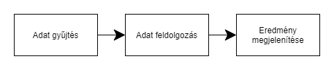

# WEATHER FORECAST
## 1. Áttekintés
A project célja, hogy egy neurális háló, ami Pythonban van megírva, megtudja jósolni az időjárási adatokat. Például hőmérséklet, esőzés, páratartalom.
Ezeket az adatokat a program egy adatbázisból szerzi(az átlag hőmérsékletet, az átlag esőzést). A program tartalmazni fog egy egyszerűbb GUI-t is. Így jobban átláthatóbb lesz.

## 2. Jelenlegi helyzet
A megrendelő szeretne pontosabb, összegzett adatokat látni az időjárásról. Az adatok felvitele után a program képes "megjósolni" az időjárast, bizonyos számolásoknak köszönhetően. Ezek az eredmények nem lesznek pontosak, csak közelítő eredmények, ezek az adatok arra jók hogy következtetéseket lehessen levonni belőllük. A program könnyen kezelhető lesz, így bárki gyorsan megtekintheti ezeket az adatokat

## 3. Jelenlegi üzleti folyamatok modellje

## 4. Igényelt üzleti folyamatok modellje

## 5. Követelmények

## 6. Használati esetek

## 7. Képernyőterv

## 8. Forgatókönyv

## 9. Fogalomszótár