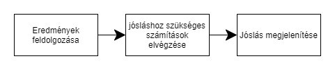

# WEATHER FORECAST
## 1. Áttekintés
A project célja, hogy egy neurális háló, ami Pythonban van megírva, megtudja jósolni az időjárási adatokat. Például hőmérséklet, esőzés, páratartalom.
Ezeket az adatokat a program egy adatbázisból szerzi(az átlag hőmérsékletet, az átlag esőzést). 
Lehetőség lesz megadni a várost melynek adatait szeretnénk jósolni.
A folyamatok lezajlása után egyszerűbb grafikonok segítségével megjelenítésre kerülnek az jósolt adatok. 

## 2. Jelenlegi helyzet
A megrendelő szeretne pontosabb, összegzett adatokat látni az időjárásról.
 Az adatok felvitele után a program képes "megjósolni" az időjárast, bizonyos számolásoknak köszönhetően. 
 Ezek az eredmények nem lesznek pontosak, csak közelítő eredmények, ezek az adatok arra jók hogy következtetéseket lehessen levonni belőllük. 
 A program könnyen kezelhető lesz, így bárki gyorsan megtekintheti ezeket az adatokat.

## 3. Jelenlegi üzleti folyamatok modellje

## 4. Igényelt üzleti folyamatok modellje

## 5. Követelmények
A programnak minimális gépigény van mint követelmények ugyanis google colab felület segítségével egy virtuális gépen fog lefutni a program a felhőben. 
Ezeken felül már csak a felhasználónak kell rendelkeznie elegendő intuicióval hogy képes legyen a programot sikeresen lefuttatni. 

## 6. Használati esetek
A felhasználónak lehetősége van egy időjárás előrejelzés készítésére programunk segítségével.

## 7. Képernyőterv
Különösebb képernyőterv nem szükséges programunkhoz ugyanis terminálon fut le és egy pandas táblázat segítségével jeleníti meg majd az előrejelzett időjárás adatokat. 

## 8. Forgatókönyv
A felhasználó megnyitja az álltalunk készített programot google colab felületen, majd elindítja és némi várakozás után megjenítődik egy táblázat ami ábrázolja az előrejelzett időjárás adatokat.

## 9. Fogalomszótár
* Python: A Python egy általános célú, nagyon magas szintű programozási nyelv.
* Pandas: A pandas a Python programozási nyelv egyik progamkönyvtára, amely adatok feldolgozására és elemzésére szolgál.
* Neurális háló: Fő alkalmazási területe a gépi tanulás, melynek célja ezeknek a hálóknak a tanuló rendszerként történő gyakorlati alkalmazása.

