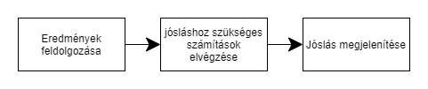

# WEATHER FORECAST
## 1. A Rendszer célja
A project célja, hogy egy neurális háló, ami Pythonban van megírva, megtudja jósolni az időjárási adatokat. Például hőmérséklet, esőzés, páratartalom.
Ezeket az adatokat a program egy adatbázisból szerzi(az átlag hőmérsékletet, az átlag esőzést). A program tartalmazni fog egy egyszerűbb GUI-t is. Így jobban átláthatóbb lesz.

## 2. Üzleti folyamatok modellje

## 3. Követelmények
* Funkcionális
    -Kapcsolat teremtése az adatbázissal,illetve szükséges információk megszerzése az adatbázisból.
    -A szükséges adatok megszerzése után az adatok átadása egy képi tanuló algoritmusnak.
    -Neurális háló segítségével a megszerzett információk alapján előrejelzés készítése.
### Nem Funkcionális 
    -Az alkalmazásnak (viszonylag) pontos,reális előrejelzést kell adni a felhasználó számára.

## 4. Funkcionális terv
* Rendszerszereplő:
    -Felhasználó
### Rendszerhasználati esetek:
* Felhasználó tudjon a programmal:
    -Pontos előrejelzés alapján információkat szerezni az időjárással (hőmérséklet, csapadék, páratartalom) kapcsolatban.

### Menü-hierarchia:
    -Legördülő lista, melyben a városnevek találhatók.
    -Gomb, amely megerősíti a várost,és elindítja az előrejelzést
    -Táblázat, melyben az adatok megjelennek,a gomb megnyomása után.

## 5. Fizikai környezet
* Fejlesztői környezet:
    -Python

## 6. Architekturális terv
Az alkalmazás a felhasználó szamítógépén fog futni.
* Specifikáció:
    - Szükséges egy megfelelő specifikációval rendelkező számítógép.
	- Szükség hogy a számítógépen telepítve legyen megfelelő futtató program (python).

## 7. Adatbázis terv
Az adatbázis tartalmaz egy városnevet,valamint a hozzá tartozó időjárási adatokat( hőmérséklet, csapadék, páratartalom, szélerősség )

## 8. Implementációs terv
Az alkalmazás a felhasználó gépén fog futni python segítségével.

## 9. Tesztterv
A minimum hardverkonfiguráció: Intel Celeron processzor, 4GB RAM, 128GB HDD, a képernyők felbontása 
1280x1024 vagy 1920x1080 valamint telepített python.

A tesztelés során a szoftver megfelelő működését vizsgáljuk. Amennyiben az elvártnak megfelelő 
eredményt kapunk, a teszt eset sikeresnek tekinthető, ellenkező esetben a hibát rögzítjük a teszt jegyzőkönyvben. Ezt követően a megtalált
hibákat javítjuk a szoftverben, és újbóli tesztelésnek vetjük alá a rendszert.

A szoftver előrejelzésének pontosságát valós adatokon teszteljük.

## 10. Telepítési terv
* Fizikai telepítési terv: 
    - Szükség van a megfelelő specifikációs számítógépre.  
* Szoftver telepítési terv: 
    - A python telepítése után telepíthető az alkalmazás

## 11. Karbantartási terv
Az alkalmazásnak nincs szüksége különösebb karbantartásra, új funkció hozzáadása esetén opcionális frissítést teszünk elérhetővé a felhasználó számára.
